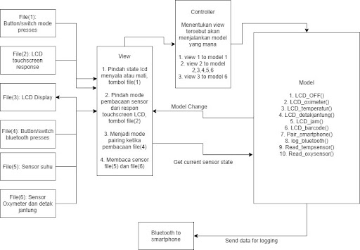

# 🔥 CoViTor Watch 🔥
### <i>#Final project of Embedded System Design</i>
- CoViToR Watch App created using Android Studio with Java

⌚⌚⌚⌚⌚

Smartwatch system, made for COVID-19 symptoms monitoring where you can monitor your current health condition such as temperature, oxygen saturation, and heart rate. So when there are any symptoms of COVID-19 you can take the appropriate action.

Stay healthy and keep wearing your mask!! 😷

#

## 🔌 How to make this embedded system.
### List of component
- Microcontroller Wemos D1 (NodeMCU ESP32 wifi+BL)
- Watch Sized SSD1306 0.96 inch OLED LCD I2C
- Enclosure Smartwatch 3D print
- A button
- Cables
- Battery 503030 3.7V mini 500mAh
- Charging controller TP4056
- 2.8cm / 28mm watch strap with 3cm spring bar
- MAX30205 Temperature Sensor 0°C to 50°C (Human Range)
- MAX30100 Heartrate and Oxymeter Sensor
- DS1307 + 24c32 Module IIC precision Real Time Clock(RTC) for Arduino (+CR2032 Battery)

Budget for component on december 2021 = Rp. 321.400 (~ US $22,34)

### Hardware Diagram

  

- <i>I2C module (MAX30100, MAX30205, DS1307, SSD1306)</i>
- SCL -> GPIO 22 (ESP32)
- SDA -> GPIO 21 (ESP32)
- Vin -> 3.3V (ESP32)
- GND -> GND (ESP32)

### Architecture Diagram

  

### MVC

  

#

## 🤖 Arduino
We're using ESP32 Wemos D1 Mini

For some other controllers including controllers which are not ESP family, may need some more configuration.

How to use this code
- Install and open arduino IDE
- Install esp32 board family, using board manager
- Clone and open "CovitorWatch.ino"
- Flash to esp32 controller using available port
- Done

Features:
- Motion detector with one button
- Menu page
- Clock page
- Heart Rate, Blood Saturation, and Temparature readings page.
- Bluetooth Sync Mode
- QR code
- Blank screen for power saving

Library:
- BluetoothSerial
- Adafruit_GFX
- Adafruit_SSD1306
- RTClib
- MAX30100_PulseOximeter
- Protocentral_MAX30205
- OneButton

### <i>*How to use</i>
- double click to OK and go to menu page.
- triple click on any page to go QR code page.
- Long click on any page to go blank screen, use double click to exit blank screen mode.

### <i>*For improvement</i>
When using bluetooth serial, the heart rate and oximeter data are not updating because a problem. On ESP32, somehow the library of MAX30100 and bluetooth serial can't work together. This is because if you use a serial bluetooth module, it will slow down the looping time of the routine. The MAX30100 library is set to update data with a sampling frequency of 100Hz, so it should take less than 10ms to call this function. For that, use a newer module such as MAX30102, to get improvement functionality.

#

## 🚨 3D Enclosure
To create the 3D enclosure, we used 3D print Creality Ender-3 Pro
with printer settings:

- Slicer App: PrusaSlicer 2.3.1
- Print Setting: 0.28mm (use 0.16mm or 0.20mm for more tidy looks)
- Filament: PLA (please use ABS or something stronger than PLA if you want more rigid)
- Infill: 15%
- Supports: None
- Duration for all parts: 1 hour (0.28mm quality)

<i>*For watch strap, please using 28mm size with 30mm Spring Bar</i>

#

Full enclosure:

  

Component arrangement:

  

#

## 📱 CoViTor Watch APP
<i>!!This app created using android studio and java languange</i>

### How this app work?
In our embedded system (CoViTor Smartwatch), we use bluetooth serial (Bluetooth 2). So we can communicate using Bluetooth Socket from android. Basically, using bluetooth serial communication to an embedded system is to use an outputstream to send data and an inputstream to get data. We just need to manage how the two work together to form a useful application. For the monitoring sequence, we use a query method when needed so that the embedded system does not always send data. First the application will send a command that the embedded system knows what to send. After that the embedded system will send sensor data to the application, and the application will parse the byte data into strings or integers for further processing.

  

### How to use this project ?
For demo purpose (if you use same firmware as this embbeded system) you can install APK app on your android phone.

If you want reverse engineering this project app:
1. Install android studio on your computer
2. Clone "CovitorWatchEmbedded" folder
3. Import that folder to android studio
4. Sync graddle (if necessary), and you success to import this app and ready to reverse engineering to your needs!

<i>if need help, feel free to contact us! MatthewBrandon21 / rellpa.</i>